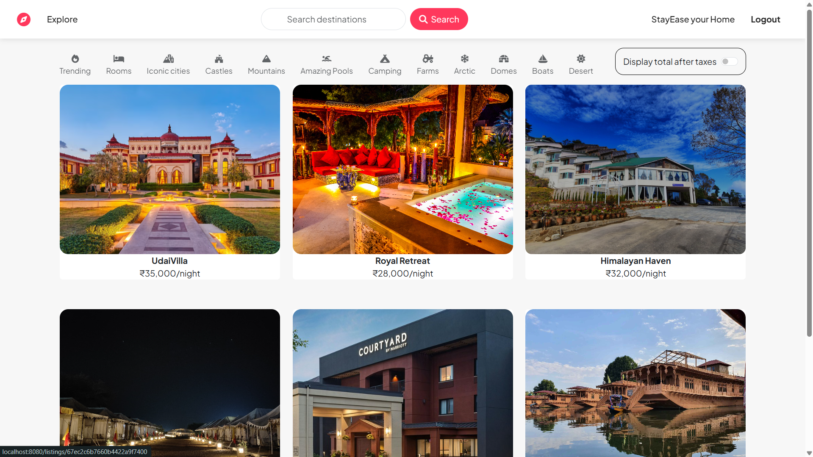
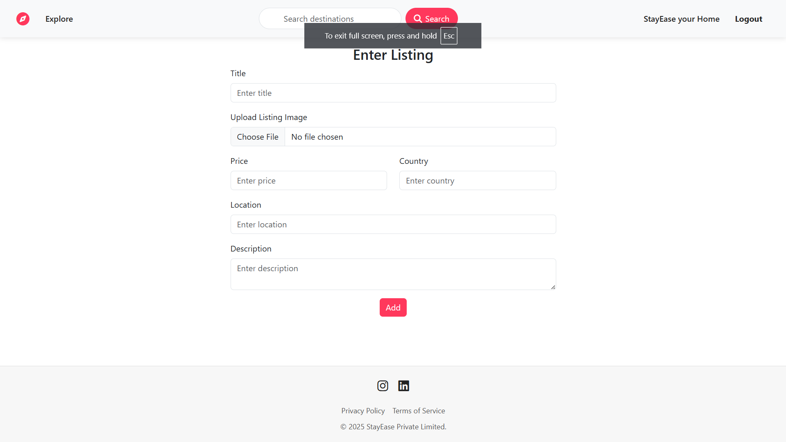
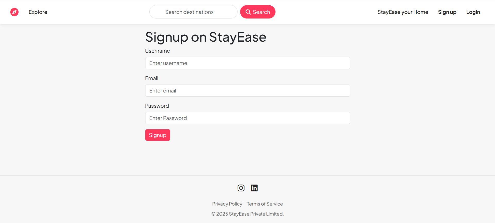
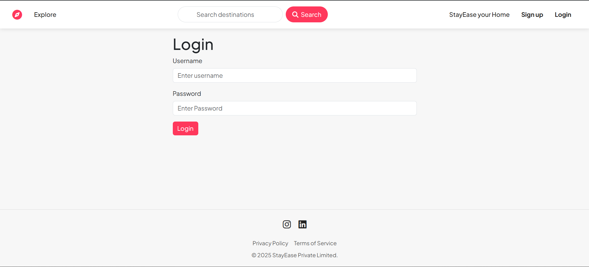
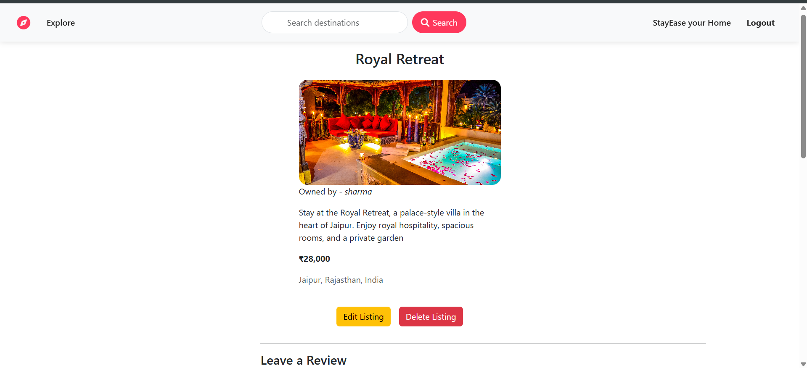
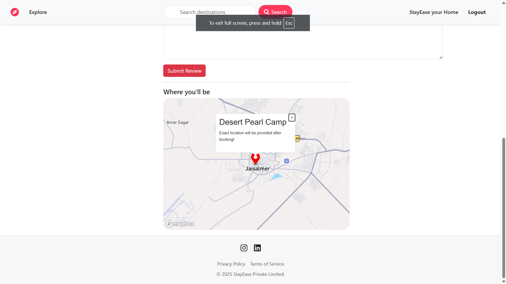

# StayEase

StayEase is a full-fledged MERN stack project that allows users to list, search, and book accommodations seamlessly. It includes features such as authentication, property management, booking functionality, and cloud-based image storage.

## 📌 Features

- 🏠 **User Authentication**: Secure login and registration with JWT authentication.
- 📍 **Property Listings**: Users can add, update, and delete their listings.
- 📅 **Booking System**: Real-time booking with availability checks.
- 💳 **Payments**: Secure payment gateway integration.
- 📷 **Image Uploads**: Cloudinary integration for image storage.
- 🛠️ **Tech Stack**: MERN (MongoDB, Express.js, React, Node.js) with Tailwind CSS for styling.

## 🖼️ Screenshots

### Home Page


### Add New Listing


### Signup Page


### Login Page


### Show Listing Page


### Show Location


## 🚀 Installation Guide

### Prerequisites
Ensure you have the following installed:
- Node.js
- MongoDB
- Git

### Steps
1. **Clone the Repository**
   ```bash
   git clone https://github.com/puneetsharma0910/StayEase.git
   cd StayEase
   ```

2. **Install Dependencies**
   ```bash
   npm install
   cd client && npm install
   ```

3. **Environment Variables**
   Create a `.env` file in the root directory and add the following:
   ```env
   MONGO_URI=your_mongodb_connection_string
   JWT_SECRET=your_jwt_secret
   CLOUDINARY_CLOUD_NAME=your_cloud_name
   CLOUDINARY_API_KEY=your_api_key
   CLOUDINARY_API_SECRET=your_api_secret
   ```

4. **Run the Application**
   ```bash
   npm run dev
   ```

## 🌍 Deployment

### Deploying to Render
1. Push your latest changes to GitHub:
   ```bash
   git add .
   git commit -m "Added screenshots and updated README"
   git push origin main
   ```
2. Deploy the backend on Render.
3. Deploy the frontend on Vercel or Netlify.

## 🤝 Contributing
Pull requests are welcome! For major changes, please open an issue first to discuss what you’d like to change.

## 📄 License
This project is licensed under the MIT License - see the [LICENSE](LICENSE) file for details.

---

Happy coding! 🚀

